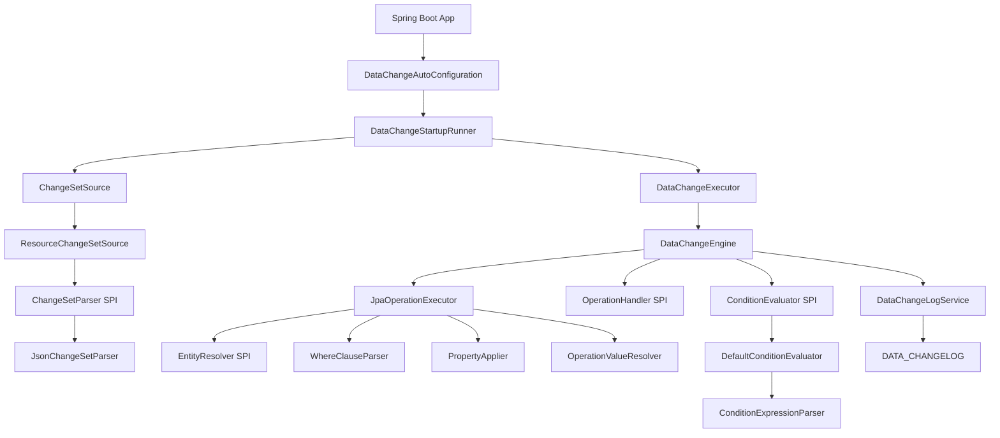

# Architecture

## Overview

DataChange is organized as a small public framework API with a Spring Boot integration layer and a set of internal execution components.

## Layers

### Public API
- `de.graube.datachange.framework.api`
- `de.graube.datachange.framework.model`
- `de.graube.datachange.framework.spi`

### Spring Integration
- `de.graube.datachange.framework.boot`
- `de.graube.datachange.framework.rest`
- `de.graube.datachange.framework.config`

### Internal Implementation
- `de.graube.datachange.framework.engine`
- `de.graube.datachange.framework.parser`
- `de.graube.datachange.framework.loader`
- `de.graube.datachange.framework.condition`
- `de.graube.datachange.framework.validation`
- `de.graube.datachange.framework.log`
- `de.graube.datachange.framework.internal`

## Extension Points

- **Conditions** via `ConditionProvider` and `ConditionEvaluator`
- **Operations** via `OperationHandler`
- **Validation** via `ChangeSetSemanticValidator`
- **Parsing** via `ChangeSetParser` and `ChangeSetSerializer`
- **Entity resolution** via `EntityResolver`

## Release Packaging

The framework module is prepared for Maven Central with:
- source JAR
- javadoc JAR
- GPG signing in release profile
- SCM metadata
- license metadata
- GitHub Actions workflows

